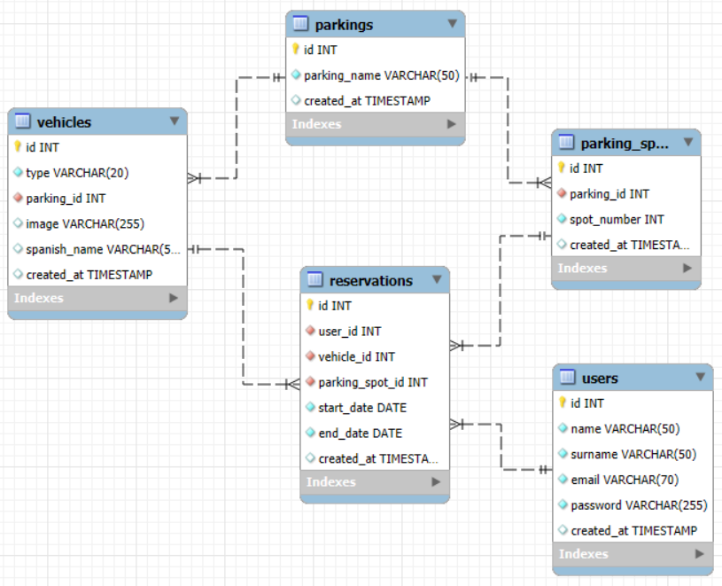
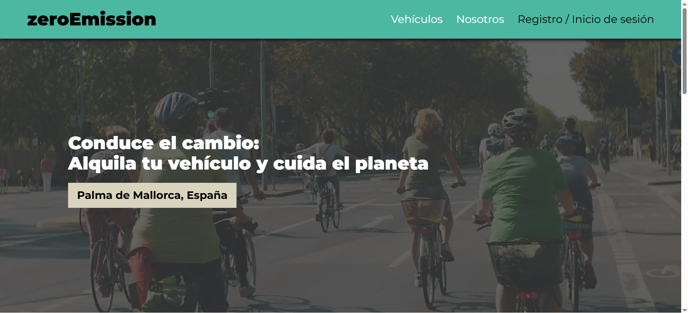
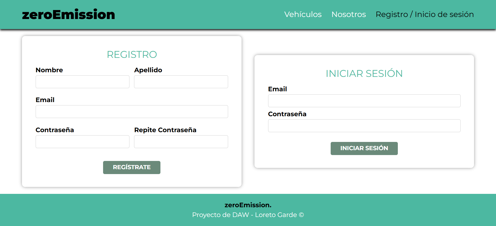
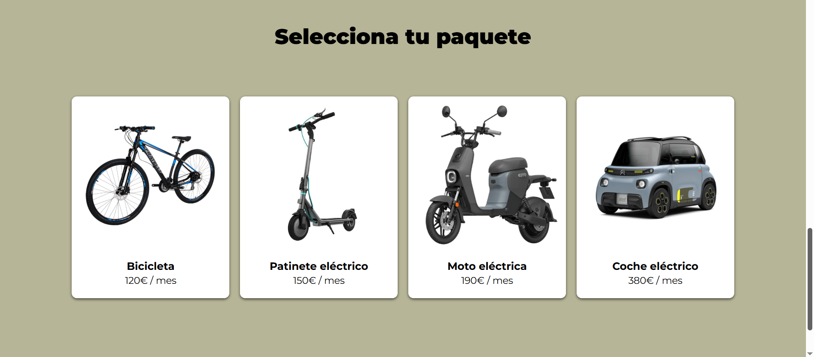
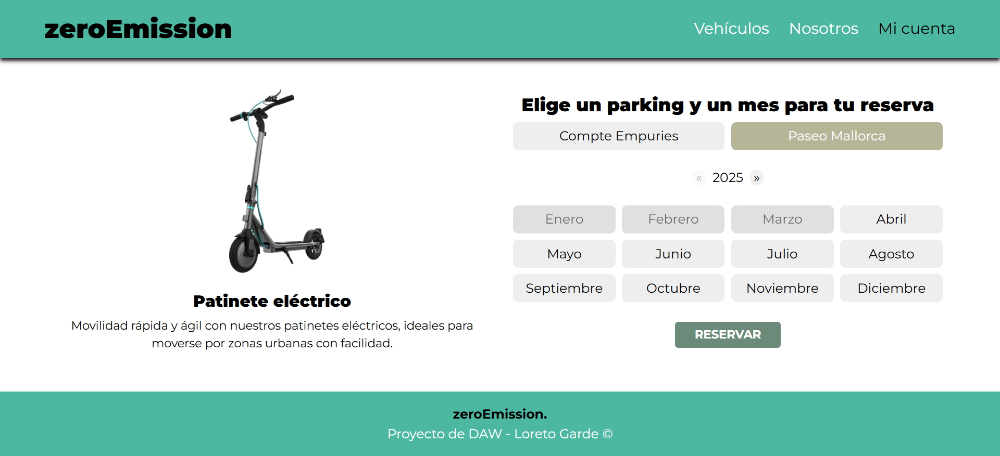
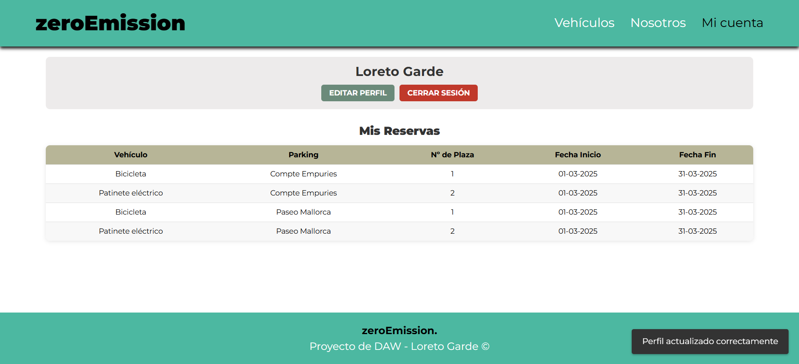
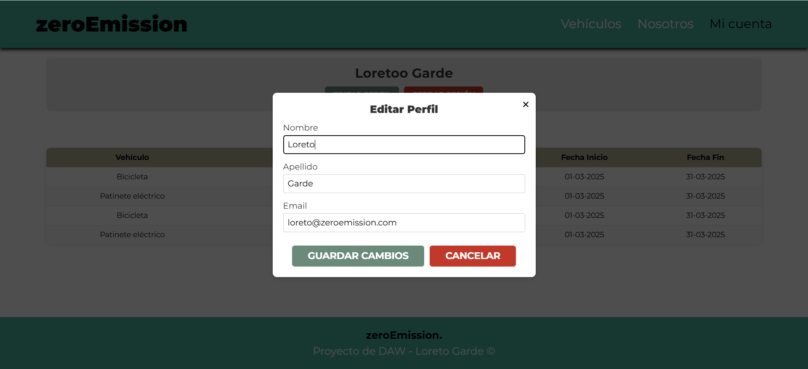

# 🌱 Zero Emission - Alquiler de parkings y vehículos

**Zero Emission** es un proyecto desarrollado como trabajo final del **Ciclo Superior de Desarrollo de Aplicaciones Web (DAW)**. Su objetivo es proponer una **solución ficticia** para la movilidad sostenible en Mallorca, ante la futura normativa de **Zonas de Bajas Emisiones (ZBE)**.

🔹 **Objetivo:** Permitir a los usuarios estacionar su vehículo personal en un parking designado y alquilar un **vehículo eléctrico** para desplazarse por la ciudad.  
🔹 **Estado:** Proyecto educativo (no comercial) con funcionalidad completa.  


 

 


---

**Visita la aplicación en Render**  
👉 **[ZeroEmission - Demo en vivo](https://zeroemission.onrender.com/)**  

---

## 📍 Motivación y Contexto  

En los próximos años, **Mallorca** implementará las **Zonas de Bajas Emisiones (ZBE)**, restringiendo la circulación de vehículos contaminantes. La falta de transporte público eficiente complica la movilidad, por lo que *Zero Emission* propone:

✅ **Parking** para vehículos personales en zonas estratégicas.  
✅ **Alquiler de vehículos eléctricos** (bicicletas, patinetes, motos y coches).  
✅ **Transición fluida** hacia un transporte más sostenible.  

---

## 🚀 Funcionalidades Principales  

1. **Registro e Inicio de Sesión**  
   - Validación de datos en frontend (JavaScript) y backend (PHP).  
   - Contraseñas cifradas en la base de datos.  

2. **Gestión de Vehículos Eléctricos**  
   - Bicicleta, patinete, moto y coche eléctrico.  
   - Consulta rápida de disponibilidad (parking y tipo de vehículo).

3. **Reservas**  
   - Comprobación de plazas libres en tiempo real.  
   - Creación de la reserva, uniendo el usuario, su vehículo eléctrico y la plaza de parking.  

4. **Perfil de Usuario**  
   - Visualización y edición de datos personales.  
   - Historial de reservas.

5. **Interfaz Responsiva**  
   - Adaptación a diferentes tamaños de pantalla.  
   - Navegación intuitiva, menús claros y formularios con retroalimentación inmediata.

---

## 🏛 Arquitectura y Tecnologías  

El proyecto se basa en un **patrón MVC** “artesanal”, sin usar frameworks pesados, y está desarrollado con:

📌 **Backend:**  
- **PHP (8.x)** - Lógica del servidor, interacción con la base de datos.  
- **MySQL** - Almacenamiento de usuarios, vehículos, parkings y reservas.  


📌 **Frontend:**  
- **HTML5, CSS3** - Interfaz gráfica y estilos.  
- **JavaScript (Vanilla)** - Interactividad en formularios y validaciones.  

📌 **Entorno de Desarrollo:**  
- **XAMPP** - Usado como servidor local.
- **Docker** - Despliegue en Render.  


El proyecto se concibió para **aprender fundamentos** (sin React, Vue o Laravel). Sin embargo, se ha trabajado con buenas prácticas (separación de capas, lógica en controladores, etc.) que sirven de base para escalar a frameworks en el futuro.

---

## 📊 Modelo Relacional y Base de Datos  

La base de datos tiene cinco tablas principales:  

📌 **`users`** → Guarda los datos de los usuarios registrados.  
📌 **`parkings`** → Define las ubicaciones de los parkings.  
📌 **`parking_spots`** → Plazas dentro de cada parking.  
📌 **`vehicles`** → Lista de vehículos eléctricos disponibles.  
📌 **`reservations`** → Almacena cada reserva con su fecha y usuario.  

### 🖼 Modelo Relacional  
  

---

## 📂 Estructura del Proyecto  

```plaintext
zeroemission/
├── public/                  
│   ├── index.php             # Punto de entrada principal
│   ├── assets/               
│   │   ├── css/              # Estilos CSS
│   │   ├── js/               # Scripts JavaScript
│   │   └── media/            # Archivos multimedia
├── src/                     
│   ├── Database/             # Configuración de la base de datos
│   ├── Controllers/          # Controladores (gestión de usuarios, reservas, etc.)
│   ├── Models/               # Modelos de datos (usuarios, vehículos, reservas)
│   ├── Views/                # Vistas (interfaz de usuario en PHP)
│   └── routes.php            # Definición de rutas
├── vendor/                   # Dependencias instaladas con Composer
├── Dockerfile                # Configuración de despliegue
├── .gitignore                # Archivos ignorados en Git
└── README.md                 # Documentación
```

---
## 📸 Capturas y Flujo de la Aplicación  

| 🏠 Página de Inicio | 🔑 Registro e Inicio de Sesión |
|----------------------|--------------------------------|
|  |  |
| **Menú de navegación dinámico** | **Formulario con validaciones** |

| 🚗 Vehículos disponibles | 🚘 Reserva de Vehículo |
|----------------------------|------------------------|
|  |  |
| **Explorar vehículos eléctricos** | **Ver disponibilidad en tiempo real y reservar** |

| 👤 Perfil y Mis Reservas | 🛠 Editar Perfil |
|------------------------|-------------------------|
|  |  |
| **Gestión del perfil e historial** | **Modificar información del usuario** |


### 📌 Flujo de la aplicación  
1️⃣ El usuario accede a la web y se registra o inicia sesión.  
2️⃣ Explora los vehículos eléctricos disponibles y comprueba su disponibilidad.  
3️⃣ Selecciona un mes y un parking para realizar la reserva.  
4️⃣ Puede consultar su historial de reservas y modificar su perfil.  

---

## 🔮 Conclusiones y Futuras Mejoras  

### 📌 Conclusiones  
- El proyecto **demuestra** la viabilidad de una plataforma que combina vehículos eléctricos y parkings.  
- Ha servido para afianzar los conocimientos en **MVC**, **MySQL**, **JavaScript** y **PHP** puro, sin frameworks.  
- Se ha comprobado la importancia de una buena **planificación** y estructura de base de datos para la gestión de reservas.

### 📌 Posibles mejoras  
- **Añadir rol de administrador** para gestionar reservas y vehículos.  
- **Integración de pasarela de pagos** con Stripe o PayPal. 💳   
- **Sistema de notificaciones por email** para confirmaciones de reserva. 📩  

---

## ✨ Autoría y Contacto

Este proyecto ha sido desarrollado por **Loreto Garde** como **Proyecto Final de DAW**.  
- **GitHub**: [loret0g](https://github.com/loret0g)  
- Para dudas o sugerencias, puedes abrir un [Issue en el repositorio](https://github.com/loret0g/zeroemission/issues).
